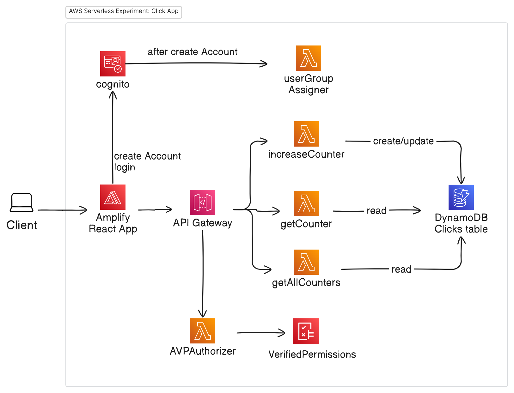
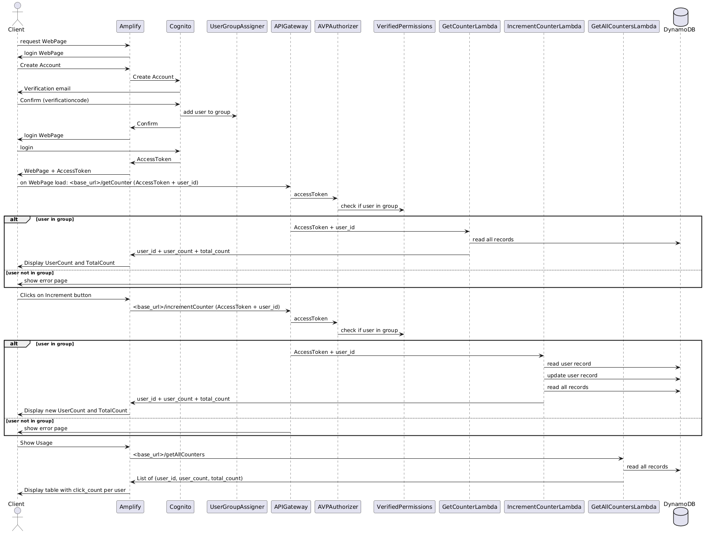

# React frontend for KLiK app

This project is created to experiment with an AWS serverless backend and React frontend.
The AWS Lambdas used for the project can be viewed at:

https://github.com/edwinbulter/klik_backend

A working example of this React frontend can be watched at:
https://main.d3sz66opung9mh.amplifyapp.com/

## AWS Components:

## Sequence Diagram:

